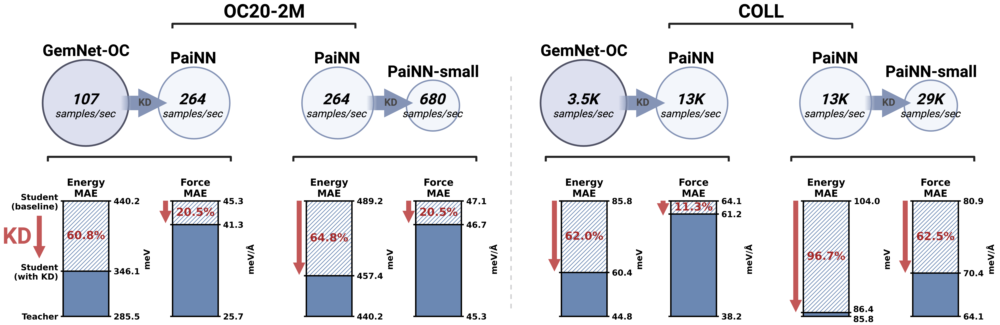
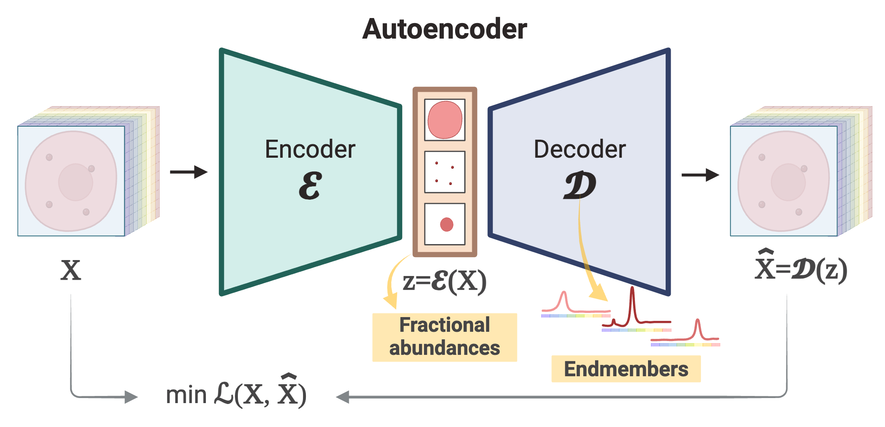

I am a PhD student in Artificial Intelligence and Machine Learning at Imperial College London working on deep learning approaches for cerebral organoid phenotyping and drug discovery under the supervision of [Prof. Mauricio Barahona](https://www.imperial.ac.uk/people/m.barahona) and [Prof. Dame Molly Stevens](https://www.stevensgroup.org).

 

Recent highlights
------

###### 2024:
- ***March:*** Started a new position as an Academic Visitor at University of Oxford.
- ***March:*** Our preprint titled *"Hyperspectral unmixing for Raman spectroscopy via physics-constrained autoencoders"* is [out](https://arxiv.org/abs/2403.04526).

###### 2023:
- ***December:*** [Presented](https://www.linkedin.com/feed/update/urn:li:activity:7142448038714699776/) our work *"Accelerating Molecular Graph Neural Networks via Knowledge Distillation"* at NeurIPS 2023 in New Orleans.
- ***November:*** Our work *"Accelerating Molecular Graph Neural Networks via Knowledge Distillation"* has been [accepted (oral)](https://logconference.org) to the Learning on Graphs (LoG) Conference 2023.
- ***September:*** Our work *"Accelerating Molecular Graph Neural Networks via Knowledge Distillation"* has been [accepted](https://nips.cc/virtual/2023/poster/72565) to the Conference on Neural Information Processing Systems (NeurIPS) 2023.
- ***July:*** Our work *"Accelerating Molecular Graph Neural Networks via Knowledge Distillation"* has been [accepted](https://syns-ml.github.io/2023/contributions/) to the Synergy of Scientific and Machine Learning Modeling workshop at the International Conference on Machine Learning (ICML) 2023.
- ***July:*** Our preprint on RamanSPy is [out](https://arxiv.org/abs/2307.13650).
- ***June:*** We introduce [RamanSPy](https://ramanspy.readthedocs.io) - an open-source Python package for integrative Raman spectroscopy data analysis.
- ***June:*** Our preprint titled *"Accelerating Molecular Graph Neural Networks via Knowledge Distillation"* is [out](https://arxiv.org/abs/2306.14818).

 

Selected publications
------
<table style="width:100%">
  <tr>
    <th width="30%">
      
    </th>
    <th style="text-align:left" width="70%">
            Accelerating Molecular Graph Neural Networks via Knowledge Distillation  
            Filip Ekström Kelvinius*, Dimitar Georgiev*, Artur Petrov Toshev*, Johannes Gasteiger  
             Conference on Neural Information Processing Systems (<strong>NeurIPS</strong>), 2023 
            [<a href="https://proceedings.neurips.cc/paper_files/paper/2023/hash/51ec452ca04d8ec7160e5bbaf76153f6-Abstract-Conference.html">Paper</a>][<a href="https://github.com/gasteigerjo/ocp/blob/main/DISTILL.md">Code</a>][<a href="https://syns-ml.github.io/2023/assets/papers/67.pdf">Paper @ SynS & ML workshop at ICML)</a>][<a href="https://openreview.net/forum?id=KWkzecJ4or">Extended Abstract @ LOG 2023 (oral)</a>]
    </th>
  </tr> 
</table>

<table style="width:100%">
  <tr>
    <th width="30%">
      
    </th>
    <th style="text-align:left" width="70%">
            RamanSPy: An open-source Python package for integrative Raman spectroscopy data analysis  
            Dimitar Georgiev, Simon Vilms Pedersen, Ruoxiao Xie, Álvaro Fernández-Galiana, Molly M. Stevens, Mauricio Barahona   
             Under review, 2024 
            [<a href="https://arxiv.org/pdf/2302.09309.pdf">Preprint</a>][<a href="https://github.com/barahona-research-group/RamanSPy">Code</a>][<a href="https://ramanspy.readthedocs.io">Documentation</a>]  <a class="github-button" href="https://github.com/barahona-research-group/RamanSPy" data-color-    scheme="no-preference: light; light: light; dark: dark;" data-icon="octicon-star" data-show-count="true" aria-label="Star barahona-research-group/RamanSPy on GitHub">Star</a>
    </th>
  </tr> 
</table>

<table style="width:100%">
  <tr>
    <th width="30%">
      
    </th>
    <th style="text-align:left" width="70%">
            Hyperspectral unmixing for Raman spectroscopy via physics-constrained autoencoders  
            Dimitar Georgiev, Álvaro Fernández-Galiana, Simon Vilms Pedersen, Georgios Papadopoulos, Ruoxiao Xie, Molly M. Stevens, Mauricio Barahona   
             Under review, 2024 
            [<a href="https://arxiv.org/abs/2403.04526">Preprint</a>]
    </th>
  </tr> 
</table>

