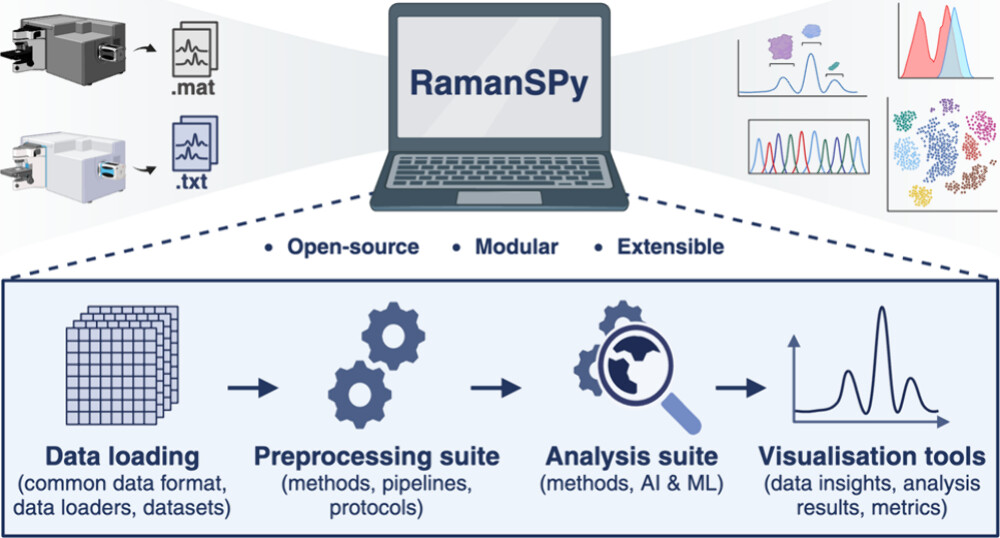

I am a PhD student in Artificial Intelligence and Machine Learning at Imperial College London working on deep learning approaches for analytical chemistry, chemometrics and drug discovery under the supervision of [Prof. Mauricio Barahona](https://www.imperial.ac.uk/people/m.barahona) and [Prof. Dame Molly Stevens](https://www.stevensgroup.org).

 

      

        <h3 style="font-size:24px;border-bottom: 1px solid #dcdcdc;margin-bottom:20px;">Interests</h3>
        <ul class="ul-interests">          
          <li>Deep learning</li>          
          <li>ML for chemometrics</li>          
          <li>ML for molecules</li>          
          <li>AI for science</li>        
          <li>AI for healthcare</li>              
          <li>Software</li>
        </ul>
      

      

      

        <h3 style="font-size:24px;border-bottom: 1px solid #dcdcdc;margin-bottom:20px;">Education</h3>
        <ul class="ul-edu fa-ul">
          <li>
            <i class="fa-li fas fa-graduation-cap"></i>
            

              
PhD in AI & ML

              
Imperial College London, UK

	    	
Oct 2021 - Present

            

          </li>
	   
          <li>
            <i class="fa-li fas fa-graduation-cap"></i>
            

              
MMath in Mathematics

              
University of Southampton, UK
		    
	      
Sep 2017 - Jul 2021

            

          </li>
        </ul>
      

 

<h3 style="font-size:24px;border-bottom: 1px solid #dcdcdc;margin-bottom:20px;">Recent highlights</h3>

###### 2024:
- ***September:*** [Presented](https://x.com/dimgeorgievv/status/1833065585275531341) our work *"Hyperspectral unmixing for Raman spectroscopy via physics-constrained autoencoders"* at BioMedEng24 conference in London.
- ***September:*** [Presented](https://x.com/dimgeorgievv/status/1833065585275531341) *RamanSPy* at BioMedEng24 conference in London.
- ***July:*** [Presented](https://x.com/dimgeorgievv/status/1818281625140056537) our work *"Hyperspectral unmixing for Raman spectroscopy via physics-constrained autoencoders"* at the AI4Science (oral) and ML4LMS workshops at ICML 2024 in Vienna.
- ***July:*** [Presented](https://x.com/dimgeorgievv/status/1818281625140056537) *RamanSPy* at the AI4Science and ML4LMS workshops at ICML 2024 in Vienna.
- ***June:*** [Presented](https://ai4health.io/wp-content/uploads/2024/08/Dimitar-montreal-768x1024.jpeg) our work *"Accelerating Molecular Graph Neural Networks via Knowledge Distillation"* at MoML 2024 in Montreal.
- ***June:*** Participated in the [ML for Drug Discovery Summer School](https://portal.ml4dd.com/summerschool).
- ***May:*** Our work *"RamanSPy: An open-source Python package for integrative Raman spectroscopy data analysis"* has been [accepted](https://doi.org/10.1021/acs.analchem.4c00383) to Analytical Chemistry.
- ***March:*** Joined the University of Oxford as an Academic Visitor.
- ***March:*** Our [preprint](https://arxiv.org/abs/2403.04526) titled *"Hyperspectral unmixing for Raman spectroscopy via physics-constrained autoencoders"* is out.

###### 2023:
- ***December:*** [Presented](https://www.linkedin.com/feed/update/urn:li:activity:7142448038714699776/) our work *"Accelerating Molecular Graph Neural Networks via Knowledge Distillation"* at NeurIPS 2023 in New Orleans.
- ***November:*** Our work *"Accelerating Molecular Graph Neural Networks via Knowledge Distillation"* has been [accepted (oral)](https://logconference.org) to the Learning on Graphs (LoG) Conference 2023.
- ***September:*** Our work *"Accelerating Molecular Graph Neural Networks via Knowledge Distillation"* has been [accepted](https://nips.cc/virtual/2023/poster/72565) to the Conference on Neural Information Processing Systems (NeurIPS) 2023.
- ***July:*** Our work *"Accelerating Molecular Graph Neural Networks via Knowledge Distillation"* has been [accepted](https://syns-ml.github.io/2023/contributions/) to the Synergy of Scientific and Machine Learning Modeling workshop at the International Conference on Machine Learning (ICML) 2023.
- ***July:*** Our [preprint](https://arxiv.org/abs/2307.13650) on RamanSPy is out.
- ***June:*** We introduce [RamanSPy](https://ramanspy.readthedocs.io) - an open-source Python package for integrative Raman spectroscopy data analysis.
- ***June:*** Our [preprint](https://arxiv.org/abs/2306.14818) titled *"Accelerating Molecular Graph Neural Networks via Knowledge Distillation"* is out.

 

<h3 style="font-size:24px;border-bottom: 1px solid #dcdcdc;margin-bottom:20px;">Selected publications</h3>

<table style="width:100%">
  <tr>
    <th width="30%">
      
    </th>
    <th style="text-align:left" width="70%">
            Accelerating Molecular Graph Neural Networks via Knowledge Distillation  
            Filip Ekström Kelvinius*, Dimitar Georgiev*, Artur Petrov Toshev*, Johannes Gasteiger
	    
*Equal contribution. Order was determined by rolling a dice.

             Conference on Neural Information Processing Systems (NeurIPS), 2023  
             <a href="#" class="cite-modal" data-toggle="modal" data-target="#citeModal" data-filename="@inproceedings%7BNEURIPS2023_51ec452c,%0A%20author%20%3D%20%7BEkstr%5C%22%7Bo%7Dm%20Kelvinius,%20Filip%20and%20Georgiev,%20Dimitar%20and%20Toshev,%20Artur%20and%20Gasteiger,%20Johannes%7D,%0A%20booktitle%20%3D%20%7BAdvances%20in%20Neural%20Information%20Processing%20Systems%7D,%0A%20editor%20%3D%20%7BA.%20Oh%20and%20T.%20Neumann%20and%20A.%20Globerson%20and%20K.%20Saenko%20and%20M.%20Hardt%20and%20S.%20Levine%7D,%0A%20pages%20%3D%20%7B25761--25792%7D,%0A%20publisher%20%3D%20%7BCurran%20Associates,%20Inc.%7D,%0A%20title%20%3D%20%7BAccelerating%20Molecular%20Graph%20Neural%20Networks%20via%20Knowledge%20Distillation%7D,%0A%20url%20%3D%20%7Bhttps%3A//proceedings.neurips.cc/paper_files/paper/2023/file/51ec452ca04d8ec7160e5bbaf76153f6-Paper-Conference.pdf%7D,%0A%20volume%20%3D%20%7B36%7D,%0A%20year%20%3D%20%7B2023%7D%0A%7D"></a> <a class="github-button" href="https://github.com/gasteigerjo/ocp/blob/main/DISTILL.md" data-color-    scheme="no-preference: light; light: light; dark: dark;" aria-label="Code" style="vertical-align: sub;">Code</a>  
	    This work has also been presented at:
	    <ul style="color:#82807f;font-weight:normal;font-size:14px;font-style: italic;">
		    <li>Synergy of Scientific and Machine Learning Modeling Workshop at International Conference on Machine Learning, 2023</li>
		    <li>Learning on Graphs Conference (oral), 2023</li>
		    <li>Molecular Machine Learning Conference, 2024</li>
	</ul>
    </th>
  </tr> 
</table>

<table style="width:100%">
  <tr>
    <th width="30%">
      
    </th>
    <th style="text-align:left" width="70%">
            RamanSPy: An open-source Python package for integrative Raman spectroscopy data analysis  
            Dimitar Georgiev, Simon Vilms Pedersen, Ruoxiao Xie, Álvaro Fernández-Galiana, Molly M. Stevens, Mauricio Barahona   
            Analytical Chemistry, 2024  
             <a href="#" class="cite-modal" data-toggle="modal" data-target="#citeModal" data-filename="@article%7Bgeorgiev2024ramanspy,%0A%20%20title=%7BRamanSPy%3A%20An%20open-source%20Python%20package%20for%20integrative%20Raman%20spectroscopy%20data%20analysis%7D,%0A%20%20author=%7BGeorgiev,%20Dimitar%20and%20Pedersen,%20Simon%20Vilms%20and%20Xie,%20Ruoxiao%20and%20Fern{\'a}ndez-Galiana,%20Alvaro%20and%20Stevens,%20Molly%20M%20and%20Barahona,%20Mauricio%7D,%0A%20%20journal=%7BAnalytical%20Chemistry%7D,%0A%20%20volume=%7B96%7D,%0A%20%20number=%7B21%7D,%0A%20%20pages=%7B8492%2D8500%7D,%0A%20%20doi=%7B10.1021/acs.analchem.4c00383%7D,%0A%20%20year=%7B2024%7D%0A%7D"></a>  <a class="github-button" href="https://github.com/barahona-research-group/RamanSPy" data-color-    scheme="no-preference: light; light: light; dark: dark;" aria-label="Code" style="vertical-align: sub;">Code</a> <a class="github-button" href="https://github.com/barahona-research-group/RamanSPy" data-color-    scheme="no-preference: light; light: light; dark: dark;" data-icon="octicon-star" data-show-count="true" aria-label="Star barahona-research-group/RamanSPy on GitHub" style="vertical-align: sub;">Star</a>   
	    This work has also been presented at:
	    <ul style="color:#82807f;font-weight:normal;font-size:14px;font-style: italic;">
		    <li>AI for Science Workshop at International Conference on Machine Learning, 2024</li>
		    <li>Machine Learning for Life and Material Science Workshop at International Conference on Machine Learning, 2024</li>
		    <li>BioMedEng24 Conference, 2024</li>
	</ul>
    </th>
  </tr> 
</table>

<table style="width:100%">
  <tr>
    <th width="30%">
      
    </th>
    <th style="text-align:left" width="70%">
            Hyperspectral unmixing for Raman spectroscopy via physics-constrained autoencoders  
            Dimitar Georgiev, Álvaro Fernández-Galiana, Simon Vilms Pedersen, Georgios Papadopoulos, Ruoxiao Xie, Molly M. Stevens, Mauricio Barahona   
             Proceedings of the National Academy of Sciences (PNAS), 2024 (<i>in press</i>)  
             <a href="#" class="cite-modal" data-toggle="modal" data-target="#citeModal" data-filename="@article%7Bgeorgiev2024hyperspectral,%0A%20%20title=%7BHyperspectral%20unmixing%20for%20Raman%20spectroscopy%20via%20physics-constrained%20autoencoders%7D,%0A%20%20author=%7BGeorgiev,%20Dimitar%20and%20Fern{\'a}ndez-Galiana,%20Alvaro%20and%20Pedersen,%20Simon%20Vilms%20and%20Papadopoulos,%20Georgios%20and%20Xie,%20Ruoxiao%20and%20Stevens,%20Molly%20M%20and%20Barahona,%20Mauricio%7D,%0A%20%20journal=%7BarXiv%20preprint%20arXiv:2403.04526%7D,%0A%20%20year=%7B2024%7D%0A%7D"></a>  
	    This work has also been presented at:
	    <ul style="color:#82807f;font-weight:normal;font-size:14px;font-style: italic;">
		    <li>AI for Science Workshop at International Conference on Machine Learning (oral), 2024</li>
		    <li>Machine Learning for Life and Material Science Workshop at International Conference on Machine Learning, 2024</li>
		    <li>BioMedEng24 Conference (oral), 2024</li>
	</ul>
    </th>
  </tr> 
</table>

  

    

      

        <h5 class="modal-title" id="citeModalLabel">BibTeX Citation</h5>
        <button type="button" class="close" data-dismiss="modal" aria-label="Close">
          &times;
        </button>
      

      

        <pre id="bibtexContent"></pre>
      

      

        <button type="button" class="btn btn-primary" onclick="copyToClipboard()">Copy to Clipboard</button>
      

    

  

My complete, up-to-date publication record is available on [Google Scholar](https://scholar.google.com/citations?user=v9OuyKAAAAAJ&hl=en).

