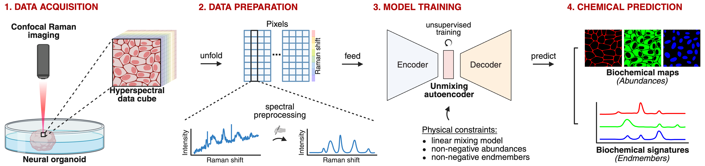
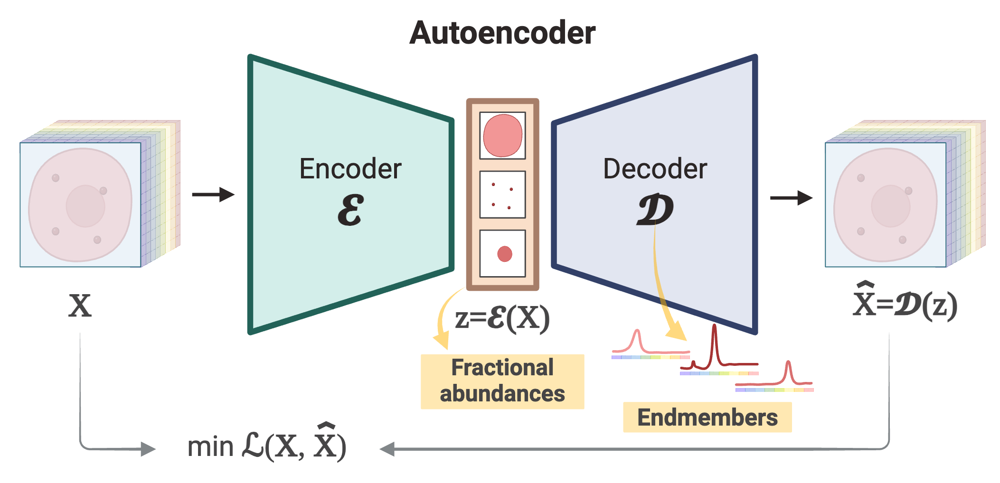
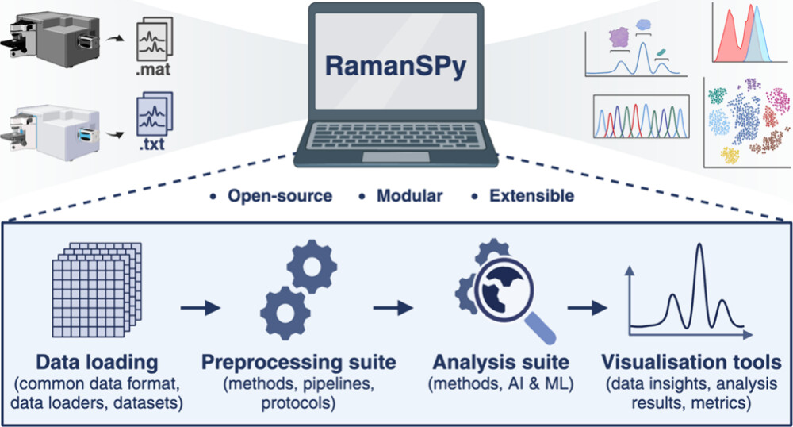
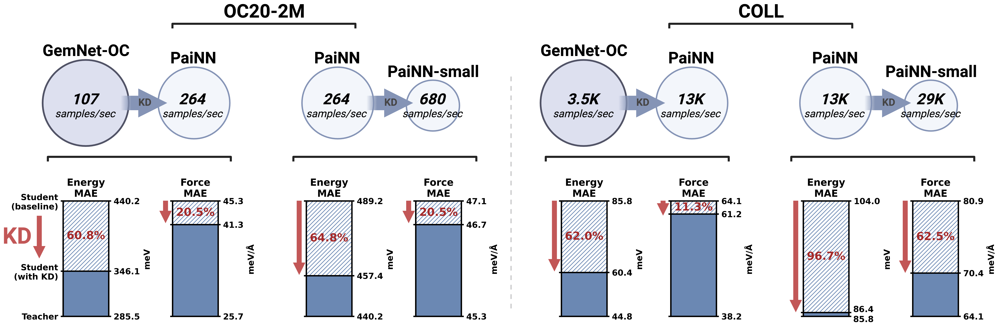

I am an AI researcher working at the intersection of machine learning, biology, chemistry and medicine.

I am currently a Postdoctoral Research Scientist in Prof. Dame Molly Stevens' group at the University of Oxford, where I develop machine learning methods for scientific discovery. My research focuses on applying AI to understand and engineer complex biological and chemical systems, with applications spanning cellular and tissue imaging, diagnostics, drug delivery and therapeutic design.

I completed my PhD in Artificial Intelligence and Machine Learning at Imperial College London in 2025, supervised by Prof. Mauricio Barahona and Prof. Dame Molly Stevens. During my PhD, I developed machine learning methods and open-source software for Raman spectroscopy, enabling label-free biochemical imaging of neural organoids to study early human brain development.

Prior to this, I obtained an MMath in Mathematics from the University of Southampton, with a minor in Computer Science, where I also worked as a Research Assistant on multi-agent systems and agent-based modelling. Alongside my academic research, I have gained industry experience in machine learning, data science and software engineering.

 

      

        <h3 style="font-size:24px;border-bottom: 1px solid #dcdcdc;margin-bottom:20px;">Interests</h3>
        <ul class="ul-interests">          
          <li>Deep learning</li>           
          <li>Analytical chemistry</li>             
          <li>Tissue analysis</li>                 
          <li>Molecular modelling</li> 
          <li>Drug discovery</li>            
          <li>AI for science</li>
        </ul>
      

      

      

        <h3 style="font-size:24px;border-bottom: 1px solid #dcdcdc;margin-bottom:20px;">Education</h3>
        <ul class="ul-edu fa-ul">
          <li>
            <i class="fa-li fas fa-graduation-cap"></i>
            

              
PhD in AI & ML

              
Imperial College London, UK

	    	
Oct 2021 - Oct 2025

            

          </li>
	   
          <li>
            <i class="fa-li fas fa-graduation-cap"></i>
            

              
MMath in Mathematics

              
University of Southampton, UK
		    
	      
Sep 2017 - Jul 2021

            

          </li>
        </ul>
      

 

<h3 style="font-size:24px;border-bottom: 1px solid #dcdcdc;margin-bottom:20px;">News</h3>

  
<h6 style="display:inline;">2026</h6>

<ul>
<h6>Feb:</h6>
<ul style="margin-bottom:.5em;list-style-type:disc">
    <li style="margin-bottom:0em">🎉 Awarded a PhD in AI & ML</li>

<b>Doctoral thesis: </b><i>From photons to phenotypes: Decoding organoid biochemistry via deep learning-enhanced Raman spectroscopy</i> 📍Imperial College London, UK

</ul> 
</ul>

  
<h6 style="display:inline;">2025</h6>

<ul>
	
<h6>Dec:</h6>

<ul style="margin-bottom:.5em;list-style-type:disc">
    <li style="margin-bottom:0em">🪧 Poster presentation at the AI4Science workshop at NeurIPS'25</li>

          <b>Title: </b><i>Label-free biochemical imaging of neural organoids via deep learning-enhanced Raman microspectroscopy</i> 📍San Diego, USA

</ul> 

<ul style="margin-bottom:.5em;list-style-type:disc">
    <li style="margin-bottom:0em">🪧 Poster presentation at the Virtual Cells and Instruments workshop at NeurIPS'25</li>

          <b>Title: </b><i>Label-free biochemical imaging of neural organoids via deep learning-enhanced Raman microspectroscopy</i> 📍San Diego, USA

</ul> 

<ul style="margin-bottom:.5em;list-style-type:disc">
    <li style="margin-bottom:0em">🪧 Poster presentation at the Imageomics workshop at NeurIPS'25</li>

          <b>Title: </b><i>Label-free biochemical imaging of neural organoids via deep learning-enhanced Raman microspectroscopy</i> 📍San Diego, USA

</ul> 
	
<h6>Oct:</h6>

<ul style="margin-bottom:.5em;list-style-type:disc">
    <li style="margin-bottom:0em">🎉 Postdoctoral Research Scientist at University of Oxford</li>
</ul>

<ul style="margin-bottom:.5em;list-style-type:disc">
    <li style="margin-bottom:0em">✅ Submitted my PhD thesis</li>
</ul>
	
<h6>September:</h6>

<ul style="margin-bottom:.5em;list-style-type:disc">
    <li style="margin-bottom:0em">📝 New preprint is out</li>

          <b>Title: </b><i>Label-free biochemical imaging and timepoint analysis of neural organoids via deep learning-enhanced Raman microspectroscopy</i>

</ul>

<h6>July:</h6>

<ul style="margin-bottom:.5em;list-style-type:disc">
    <li style="margin-bottom:0em">Attended ICML'25</li>

📍Vancouver, Canada

</ul>

 <ul style="margin-bottom:.5em;list-style-type:disc">
    <li style="margin-bottom:0em">🎤 Oral presentation at AI4X</li>

          <b>Title: </b><i>Hyperspectral Unmixing for Raman Spectroscopy via Physics-Constrained Autoencoders</i> 📍Singapore

</ul>

<h6>June:</h6>
<ul style="margin-bottom:.5em;list-style-type:disc">
    <li style="margin-bottom:0em">RamanSPy <a href="https://pubs.acs.org/action/showMostReadArticles?topArticlesType=recent&amp;journalCode=ancham">#7 most-read article in Analytical Chemistry</a> in the past year</li>
</ul>

<h6>May:</h6>
<ul style="margin-bottom:.5em;list-style-type:disc">
    <li style="margin-bottom:0em">🪧 Poster presentation at CAI4H'25</li>

📍York, UK

</ul> 

<ul style="margin-bottom:.5em;list-style-type:disc">
    <li style="margin-bottom:0em">Attended AISTATS'25</li>

📍Phuket, Thailand

</ul>

<h6>April:</h6>
<ul style="margin-bottom:.5em;list-style-type:disc">
    <li style="margin-bottom:0em">🪧 Poster presentation at the LMRL workshop at ICLR'25</li>

<b>Title: </b><i>Label-free biochemical imaging and timepoint analysis of neural organoids via deep learning-enhanced Raman microspectroscopy</i> 📍Singapore

</ul> 
</ul>

  
<h6 style="display:inline;">2024</h6>

<ul>
<h6>November:</h6>
<ul style="margin-bottom:.5em;list-style-type:disc">
    <li style="margin-bottom:0em">🪧 Poster presentation at RamanFest2024 - won the Best PhD Poster award</li>

          <b>Title: </b><i>Hyperspectral unmixing for Raman spectroscopy via physics-constrained autoencoders</i> 📍Paris, France

</ul>

<h6>October:</h6>
<ul style="margin-bottom:.5em;list-style-type:disc">
    <li style="margin-bottom:0em">📄 Paper published in PNAS</li>

          <b>Title: </b><i>Hyperspectral unmixing for Raman spectroscopy via physics-constrained autoencoders</i>

</ul>

<h6>September:</h6>

 <ul style="margin-bottom:.5em;list-style-type:disc">
    <li style="margin-bottom:0em">🎤 Oral presentation at BioMedEng24</li>

          <b>Title: </b><i>Hyperspectral Unmixing for Raman Spectroscopy via Physics-Constrained Autoencoders</i> 📍London, UK

</ul>
<ul style="margin-bottom:.5em;list-style-type:disc">
    <li style="margin-bottom:0em">🪧 Poster presentation at BioMedEng24</li>

          <b>Title: </b><i>RamanSPy: An Open-Source Python Package for Raman Spectroscopy Data Analysis</i> 📍London, UK

</ul> 

<h6>July:</h6>
<ul style="margin-bottom:.5em;list-style-type:disc">
    <li style="margin-bottom:0em">🎤 Oral presentation at the AI4Science workshop at ICML'24</li>

          <b>Title: </b><i>Hyperspectral Unmixing for Raman Spectroscopy via Physics-Constrained Autoencoders</i> 📍Vienna, Austria

</ul>
<ul style="margin-bottom:.5em;list-style-type:disc">
    <li style="margin-bottom:0em">🪧 Poster presentation at the AI4Science workshop at ICML'24</li>

          <b>Title: </b><i>RamanSPy: Augmenting Raman spectroscopy data analysis with AI</i> 📍Vienna, Austria

</ul> 
<ul style="margin-bottom:.5em;list-style-type:disc">
    <li style="margin-bottom:0em">🪧 Poster presentation at the ML4LMS workshop at ICML'24</li>

          <b>Title: </b><i>Hyperspectral Unmixing for Raman Spectroscopy via Physics-Constrained Autoencoders</i> 📍Vienna, Austria

</ul>
<ul style="margin-bottom:.5em;list-style-type:disc">
    <li style="margin-bottom:0em">🪧 Poster presentation at the ML4LMS workshop at ICML'24</li>

          <b>Title: </b><i>RamanSPy: Augmenting Raman spectroscopy data analysis with AI</i> 📍Vienna, Austria

</ul>	

<h6>June:</h6>
<ul style="margin-bottom:.5em;list-style-type:disc">
    <li style="margin-bottom:0em">🪧 Poster presentation at MoML'24</li>

          <b>Title: </b><i>Accelerating Molecular Graph Neural Networks via Knowledge Distillation</i> 📍Montreal, Canada

</ul>
<ul style="margin-bottom:.5em;list-style-type:disc">
    <li style="margin-bottom:0em">🏫 Participated in the ML for Drug Discovery Summer School</li>

        📍Montreal, Canada

</ul> 

<h6>May:</h6>
<ul style="margin-bottom:.5em;list-style-type:disc">
    <li style="margin-bottom:0em">📄 Paper published in Analytical Chemistry</li>

          <b>Title: </b><i>RamanSPy: An Open-Source Python Package for Integrative Raman Spectroscopy Data Analysis</i>

</ul>

<ul style="margin-bottom:.5em;list-style-type:disc">
    <li style="margin-bottom:0em">🪧 Poster presentation at CAI4H'24</li>

          <b>Title: </b><i>Hyperspectral Unmixing for Raman Spectroscopy via Physics-Constrained Autoencoders</i> 📍Edinburgh, UK

</ul>

<h6>March:</h6>
<ul style="margin-bottom:.5em;list-style-type:disc">
    <li style="margin-bottom:0em">🏛️ Joined University of Oxford as Academic Visitor</li>

        📍Oxford, UK

</ul>
<ul style="margin-bottom:.5em;list-style-type:disc">
    <li style="margin-bottom:0em">📝 New preprint is out</li>

          <b>Title: </b><i>Hyperspectral Unmixing for Raman Spectroscopy via Physics-Constrained Autoencoders</i>

</ul>	
</ul>

  
<h6 style="display:inline;">2023</h6>

<ul>
<h6>December:</h6>

<ul style="margin-bottom:.5em;list-style-type:disc">
    <li style="margin-bottom:0em">🪧 Poster presentation at NeurIPS'23</li>

          <b>Title: </b><i>Accelerating Molecular Graph Neural Networks via Knowledge Distillation</i> 📍New Orleans, USA

</ul>

<h6>November:</h6>
<ul style="margin-bottom:.5em;list-style-type:disc">
    <li style="margin-bottom:0em">🎤 Oral presentation at LoG'23</li>

          <b>Title: </b><i>Accelerating Molecular Graph Neural Networks via Knowledge Distillation</i> 📍virtual

</ul>

<h6>September:</h6>
<ul style="margin-bottom:.5em;list-style-type:disc">
    <li style="margin-bottom:0em">📄 Paper accepted to NeurIPS'23</li>

          <b>Title: </b><i>Accelerating Molecular Graph Neural Networks via Knowledge Distillation</i>

</ul>

<h6>July:</h6>
<ul style="margin-bottom:.5em;list-style-type:disc">
    <li style="margin-bottom:0em">🪧 Poster presentation at the SynS&ML workshop at ICML'23</li>

          <b>Title: </b><i>Accelerating Molecular Graph Neural Networks via Knowledge Distillation</i> 📍Hawaii, USA

</ul>
<ul style="margin-bottom:.5em;list-style-type:disc">
    <li style="margin-bottom:0em">📝 New preprint is out</li>

          <b>Title: </b><i>RamanSPy: An Open-Source Python Package for Integrative Raman Spectroscopy Data Analysis</i>

</ul>

<h6>June:</h6>
<ul style="margin-bottom:.5em;list-style-type:disc">
    <li style="margin-bottom:0em">💻 New Python package called RamanSPy</li>

          <b>Scope: </b><i>Raman spectroscopy data analytics</i>

</ul>
<ul style="margin-bottom:.5em;list-style-type:disc">
    <li style="margin-bottom:0em">📝 New preprint is out</li>

          <b>Title: </b><i>Accelerating Molecular Graph Neural Networks via Knowledge Distillation</i>

</ul>

<h6>May:</h6>
<ul style="margin-bottom:.5em;list-style-type:disc">
    <li style="margin-bottom:0em">🪧 Poster presentation at CAI4H'23</li>

          <b>Title: </b><i>Cell phenotyping via hyperspectral unmixing autoencoders</i> 📍York, UK

</ul>

</ul>

 

<h3 style="font-size:24px;border-bottom: 1px solid #dcdcdc;margin-bottom:20px;">Selected publications</h3>

<table style="width:100%">
  <tr>
    <th width="30%">
      
    </th>
    <th style="text-align:left" width="70%">
            Label-free biochemical imaging and timepoint analysis of neural organoids via deep learning-enhanced Raman microspectroscopy  
            Dimitar Georgiev, Ruoxiao Xie, Daniel Reumann, Xiaoyu Zhao, Álvaro Fernández-Galiana, Mauricio Barahona, Molly M. Stevens. (under review).   
             Preprint available on bioRxiv: 10.1101/2025.09.29.679057, 2025.  
                
	    This work has also been presented:
	    <ul style="color:#82807f;font-weight:normal;font-size:12px;font-style: italic;">
		    <li>LMRL @ ICLR’25, AI4Science @ NeurIPS’25, AI4D3 @ NeurIPS’25, Imageomics @ NeurIPS’25, CAI4H’25</li>
	</ul>
    </th>
  </tr> 
</table>

<table style="width:100%">
  <tr>
    <th width="30%">
      
    </th>
    <th style="text-align:left" width="70%">
            Hyperspectral unmixing for Raman spectroscopy via physics-constrained autoencoders  
            Dimitar Georgiev, Álvaro Fernández-Galiana, Simon Vilms Pedersen, Georgios Papadopoulos, Ruoxiao Xie, Molly M. Stevens, Mauricio Barahona   
             PNAS, 2024  
             <a href="#" class="cite-modal" data-toggle="modal" data-target="#citeModal" data-filename="@article%7Bgeorgiev2024hyperspectral,%0A%20%20title=%7BHyperspectral%20unmixing%20for%20Raman%20spectroscopy%20via%20physics-constrained%20autoencoders%7D,%0A%20%20author=%7BGeorgiev,%20Dimitar%20and%20Fern{\'a}ndez-Galiana,%20Alvaro%20and%20Pedersen,%20Simon%20Vilms%20and%20Papadopoulos,%20Georgios%20and%20Xie,%20Ruoxiao%20and%20Stevens,%20Molly%20M%20and%20Barahona,%20Mauricio%7D,%0A%20%20journal=%7BProceedings%20of%20the%20National%20Academy%20of%20Sciences%7D,%0A%20%20volume=%7B121%7D,%0A%20%20number=%7B45%7D,%0A%20%20pages=%7Be2407439121%7D,%0A%20%20doi=%7B10.1073/pnas.2407439121%7D,%0A%20%20year=%7B2024%7D%0A%7D"></a> <a class="github-button" href="https://github.com/barahona-research-group/raman-unmixing-aes" data-color-    scheme="no-preference: light; light: light; dark: dark;" aria-label="Code" style="vertical-align: sub;">Code</a>   
	    This work has also been presented at:
	    <ul style="color:#82807f;font-weight:normal;font-size:12px;font-style: italic;">
		    <li>AI4Science @ ICML’24 (oral), ML4LMS @ ICML’24, AI4X’25 (oral), BioMedEng24 (oral), RamanFest’24 (Best PhD poster award), CAI4H’24</li>
	</ul>
    </th>
  </tr> 
</table>

<table style="width:100%">
  <tr>
    <th width="30%">
      
    </th>
    <th style="text-align:left" width="70%">
            RamanSPy: An open-source Python package for integrative Raman spectroscopy data analysis  
            Dimitar Georgiev, Simon Vilms Pedersen, Ruoxiao Xie, Álvaro Fernández-Galiana, Molly M. Stevens, Mauricio Barahona   
            Analytical Chemistry, 2024  
             <a href="#" class="cite-modal" data-toggle="modal" data-target="#citeModal" data-filename="@article%7Bgeorgiev2024ramanspy,%0A%20%20title=%7BRamanSPy%3A%20An%20open-source%20Python%20package%20for%20integrative%20Raman%20spectroscopy%20data%20analysis%7D,%0A%20%20author=%7BGeorgiev,%20Dimitar%20and%20Pedersen,%20Simon%20Vilms%20and%20Xie,%20Ruoxiao%20and%20Fern{\'a}ndez-Galiana,%20Alvaro%20and%20Stevens,%20Molly%20M%20and%20Barahona,%20Mauricio%7D,%0A%20%20journal=%7BAnalytical%20Chemistry%7D,%0A%20%20volume=%7B96%7D,%0A%20%20number=%7B21%7D,%0A%20%20pages=%7B8492%2D8500%7D,%0A%20%20doi=%7B10.1021/acs.analchem.4c00383%7D,%0A%20%20year=%7B2024%7D%0A%7D"></a>  <a class="github-button" href="https://github.com/barahona-research-group/RamanSPy" data-color-    scheme="no-preference: light; light: light; dark: dark;" aria-label="Code" style="vertical-align: sub;">Code</a> <a class="github-button" href="https://github.com/barahona-research-group/RamanSPy" data-color-    scheme="no-preference: light; light: light; dark: dark;" data-icon="octicon-star" data-show-count="true" aria-label="Star barahona-research-group/RamanSPy on GitHub" style="vertical-align: sub;">Star</a>   
	    This work has also been presented at:
	    <ul style="color:#82807f;font-weight:normal;font-size:12px;font-style: italic;">
		    <li>AI4Science @ ICML’24, ML4LMS @ ICML’24, BioMedEng24</li>
	</ul>
    </th>
  </tr> 
</table>

<table style="width:100%">
  <tr>
    <th width="30%">
      
    </th>
    <th style="text-align:left" width="70%">
            Accelerating Molecular Graph Neural Networks via Knowledge Distillation  
            Filip Ekström Kelvinius*, Dimitar Georgiev*, Artur Petrov Toshev*, Johannes Gasteiger
	    
*Equal contribution. Order was determined by rolling a dice.

             NeurIPS, 2023  
             <a href="#" class="cite-modal" data-toggle="modal" data-target="#citeModal" data-filename="@inproceedings%7BNEURIPS2023_51ec452c,%0A%20author%20%3D%20%7BEkstr%5C%22%7Bo%7Dm%20Kelvinius,%20Filip%20and%20Georgiev,%20Dimitar%20and%20Toshev,%20Artur%20and%20Gasteiger,%20Johannes%7D,%0A%20booktitle%20%3D%20%7BAdvances%20in%20Neural%20Information%20Processing%20Systems%7D,%0A%20editor%20%3D%20%7BA.%20Oh%20and%20T.%20Neumann%20and%20A.%20Globerson%20and%20K.%20Saenko%20and%20M.%20Hardt%20and%20S.%20Levine%7D,%0A%20pages%20%3D%20%7B25761--25792%7D,%0A%20publisher%20%3D%20%7BCurran%20Associates,%20Inc.%7D,%0A%20title%20%3D%20%7BAccelerating%20Molecular%20Graph%20Neural%20Networks%20via%20Knowledge%20Distillation%7D,%0A%20url%20%3D%20%7Bhttps%3A//proceedings.neurips.cc/paper_files/paper/2023/file/51ec452ca04d8ec7160e5bbaf76153f6-Paper-Conference.pdf%7D,%0A%20volume%20%3D%20%7B36%7D,%0A%20year%20%3D%20%7B2023%7D%0A%7D"></a> <a class="github-button" href="https://github.com/gasteigerjo/ocp/blob/main/DISTILL.md" data-color-    scheme="no-preference: light; light: light; dark: dark;" aria-label="Code" style="vertical-align: sub;">Code</a>  
	    This work has also been presented at:
	    <ul style="color:#82807f;font-weight:normal;font-size:12px;font-style: italic;">
		    <li> SynS&ML @ ICML’23, LoG’23 (oral), MoML’24</li>
	</ul>
    </th>
  </tr> 
</table>

  

    

      

        <h5 class="modal-title" id="citeModalLabel">BibTeX Citation</h5>
        <button type="button" class="close" data-dismiss="modal" aria-label="Close">
          &times;
        </button>
      

      

        <pre id="bibtexContent"></pre>
      

      

        <button type="button" class="btn btn-primary" onclick="copyToClipboard()">Copy to Clipboard</button>
      

    

  

My complete, up-to-date publication record is available on [Google Scholar](https://scholar.google.com/citations?user=v9OuyKAAAAAJ&hl=en).

